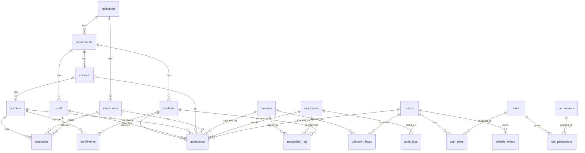

# Section 8 — Complete Database Schema

All tables below are defined in `database/models.py` and verified against
the Alembic migrations. Types are SQLAlchemy column types.

## 8.1 ER Diagram (Mermaid)

## 8.2 Table-by-Table Reference

### 8.2.1 RBAC & Users

#### `users`
| Column | Type | Notes |
|--------|------|-------|
| id | Integer PK | autoincrement |
| username | String(100) UNIQUE | |
| email | String(255) UNIQUE | |
| password_hash | String(255) | bcrypt |
| oidc_sub | String(255) UNIQUE NULL | OIDC subject |
| oidc_provider | String(50) NULL | azure/keycloak/google |
| auth_method | String(20) | local / oidc / both |
| is_mfa_enabled | Boolean | |
| mfa_totp_secret | String(64) NULL | Base32 |
| mfa_backup_codes | JSON NULL | SHA-256 hashes |
| mfa_last_verified | DateTime NULL | |
| is_active | Boolean | |
| last_login_at | DateTime NULL | |
| created_at / updated_at | DateTime | `_utcnow` defaults |

Relationships: `roles` (M:N via `user_roles`).

#### `roles`
`id` PK, `name` String(50) UNIQUE, `description` Text.
Enum `RoleName`: SUPER_ADMIN, COLLEGE_ADMIN, HOD, FACULTY, SECURITY, STUDENT, STAFF.
Relationships: `permissions` (M:N), `users` (M:N).

#### `permissions`
`id` PK, `resource` String(100), `action` String(50), `description` Text.
Unique index `(resource, action)`.
`ActionType`: READ, CREATE, UPDATE, DELETE, EXECUTE.

#### `user_roles` (association)
`user_id` FK→users.id, `role_id` FK→roles.id (composite PK).

#### `role_permissions` (association)
`role_id` FK→roles.id, `permission_id` FK→permissions.id (composite PK).

### 8.2.2 Auth Extras

#### `failed_login_attempts`
`id` PK, `username` String(100) indexed, `ip_address` String(45) indexed,
`user_agent` String(500), `attempted_at` DateTime indexed, `success` Boolean.
Indexes: `(username, attempted_at)`, `(ip_address, attempted_at)`.

#### `refresh_tokens`
`id` PK, `user_id` FK→users.id, `token_hash` String(128) UNIQUE,
`expires_at` DateTime, `created_at`, `revoked_at` NULL, `replaced_by`
String(128) NULL (rotation chain), `device_info` String(255),
`ip_address` String(45). Index: `(user_id, revoked_at)`.
Properties: `is_revoked`, `is_expired`.

### 8.2.3 College Structure

#### `institutions`
`id` PK, `name` String(255), `code` String(20) UNIQUE, `address` Text,
`phone` String(20), `email` String(255), `is_active` Boolean.
Relationships: `departments`.

#### `departments`
`id` PK, `institution_id` FK→institutions.id, `name` String(255),
`code` String(20), `head_id` FK→staff.id (named `fk_departments_head_id`,
use_alter) NULL, `is_active`. Unique `(institution_id, code)`.
Relationships: institution, head, courses, students, staff_members.

#### `courses`
`id` PK, `department_id` FK→departments.id, `code` String(50),
`name` String(255), `credits` Integer default 3, `description` Text,
`is_active`. Unique `(department_id, code)`.

#### `sections`
`id` PK, `course_id` FK→courses.id, `section_name` String(50),
`semester` String(20), `year` Integer, `max_capacity` Integer NULL.
Index `(course_id, semester, year)`.

#### `classrooms`
`id` PK, `institution_id` FK, `building` String(100), `room_number`
String(20), `capacity` Integer NULL, `floor` String(20), `is_active`.
Unique `(building, room_number)`. Relationships: cameras, attendance_records.

#### `timetables`
`id` PK, `section_id` FK→sections.id, `classroom_id` FK→classrooms.id,
`day_of_week` Integer (0=Mon..6=Sun), `start_time` String(8), `end_time`
String(8), `instructor_id` FK→staff.id NULL.
Indexes: `(section_id, day_of_week)`, `(classroom_id, day_of_week, start_time)`.

### 8.2.4 People

#### `students`
`id` PK, `student_id` String(20) UNIQUE, `name` String(100), `email`
String(255), `phone` String(20), `department_id` FK→departments.id NULL,
`enrollment_year` / `graduation_year` Integer NULL, `is_active`,
`created_at`.
Indexes: `student_id` (unique), `name`, `(department_id, is_active)`.

#### `staff`
`id` PK, `employee_id` String(20) UNIQUE, `name` String(100), `email`,
`phone`, `department_id` FK NULL, `position` String(100), `is_active`,
`created_at`. Index: `employee_id` (unique).

#### `employees` (legacy, backward-compatible)
`id` PK, `employee_id` String(20) UNIQUE, `name` String(100),
`department` String(100) NULL, `photo_path` String(500) NULL,
`faiss_id` Integer NULL, `created_at`/`updated_at`.
Relationships: attendance_records, audit_logs, recognition_logs.

### 8.2.5 Enrollment

#### `enrollments`
`id` PK, `student_id` FK→students.id, `section_id` FK→sections.id,
`enrollment_date` DateTime default now, `status` String(20) default ACTIVE.
Unique `(student_id, section_id)`.

### 8.2.6 Cameras

#### `cameras`
`id` PK, `name` String(100), `camera_index` Integer NULL,
`camera_id` String(50) UNIQUE, `stream_url` String(500) NULL,
`credential_ref` String(255) NULL (secrets-manager reference),
`location` String(200), `building` String(100), `room` String(50),
`classroom_id` FK→classrooms.id NULL, `is_active` Boolean, `status`
String(20) default OFFLINE, `last_seen` DateTime NULL, `fps` Integer,
`resolution` String(20), `created_at`/`updated_at`.
Indexes: `camera_id` (unique), `status`.

### 8.2.7 Attendance

#### `attendance`
| Column | Type | Notes |
|--------|------|-------|
| id | Integer PK | |
| student_id | FK→students.id NULL | primary person |
| employee_id | FK→employees.id NULL | legacy path |
| section_id / course_id / classroom_id / instructor_id | FK NULL | timetable context |
| camera_id | FK→cameras.id NULL | capture source |
| timestamp | DateTime NOT NULL indexed | |
| recognized_at | DateTime NULL | |
| confidence | Float NOT NULL default 1.0 | |
| method | String(50) default FACE_RECOGNITION | |
| status | String(20) default PRESENT | PRESENT/ABSENT/LATE/EXCUSED |
| marked_by_user_id | FK→users.id NULL | manual override |
| marked_manually | Boolean default False | |
| manual_notes | Text NULL | |

Indexes: `timestamp`, `(student_id, timestamp)`, `(student_id, section_id)`,
`(course_id, timestamp)`, `(camera_id, timestamp)`.

### 8.2.8 Recognition & Unknown Faces

#### `recognition_log`
`id` PK, `employee_id`/`student_id` FK NULL, `is_known` Boolean NOT NULL,
`confidence` Float, `liveness_confidence` Float, `is_spoof` Boolean,
`track_id` String(50), `timestamp` DateTime indexed, `camera_id` FK,
`classroom_id` FK, `section_id` FK, `face_snapshot_path` String(500),
`embedding_path` String(500), `frame_number` Integer,
`processing_time_ms` Float.
Indexes: `timestamp`, `is_known`, `employee_id`, `student_id`,
`(camera_id, timestamp)`.

#### `unknown_faces`
`id` PK, `image_path` String(500) NOT NULL, `embedding_path`/`thumbnail_path`
String(500) NULL, `camera_id` FK, `classroom_id` FK, `timestamp` indexed,
`confidence` Float, `liveness_score` Float, `track_id` String(50),
`is_spoof` Boolean, `reviewed` Boolean, `reviewed_by` FK→users.id,
`reviewed_at` DateTime, `converted_to_employee` Boolean, `notes` Text,
`retention_expires_at` DateTime, `face_metadata` JSON.
Indexes: `timestamp`, `reviewed`, `retention_expires_at`,
`(camera_id, timestamp)`, `(camera_id, reviewed)`.

### 8.2.9 Audit

#### `audit_logs`
`id` PK, `action` String(50) (AuditAction enum), `actor` String(100)
(synonym `operator`), `actor_type` String(20) default USER,
`actor_id` FK→employees.id NULL (synonym `employee_id`), `timestamp`
DateTime indexed, `resource_type` String(50), `resource_id` Integer,
`description` Text, `ip_address` String(45), `user_agent` String(500),
`request_id` String(100), `details` JSON, `severity` String(20) default INFO.
Indexes: `timestamp`, `actor`, `action`, `severity`, `(actor, timestamp)`.

`AuditAction` enum: USER_LOGIN, USER_LOGOUT, ATTENDANCE_MARKED/MODIFIED/
DELETED, STUDENT_ENROLLED/UPDATED/DELETED, EMPLOYEE_ENROLLED/UPDATED,
CAMERA_ADDED/REMOVED/STATUS_CHANGED, UNKNOWN_FACE_REVIEWED/DELETED,
PERMISSION_GRANTED/REVOKED, ROLE_ASSIGNED/REMOVED, SYSTEM_CONFIG_CHANGED,
DATA_EXPORTED/DELETED, SECURITY_ALERT, PASSWORD_CHANGED/
PASSWORD_CHANGE_FAILED, RECOGNITION_EVENT, ATTENDANCE_SYNC.

## 8.3 Relationships Summary (FK map)

| FK | From | To |
|----|------|----|
| departments.institution_id | departments | institutions |
| departments.head_id | departments | staff (use_alter) |
| courses.department_id | courses | departments |
| sections.course_id | sections | courses |
| timetables.section_id / classroom_id / instructor_id | timetables | sections / classrooms / staff |
| students.department_id | students | departments |
| staff.department_id | staff | departments |
| enrollments.student_id / section_id | enrollments | students / sections |
| cameras.classroom_id | cameras | classrooms |
| attendance.* | attendance | students / employees / sections / courses / classrooms / staff / cameras / users |
| recognition_log.* | recognition_log | employees / students / cameras / classrooms / sections |
| unknown_faces.* | unknown_faces | cameras / classrooms / users |
| refresh_tokens.user_id | refresh_tokens | users |
| audit_logs.actor_id | audit_logs | employees |
| user_roles / role_permissions | associations | users↔roles / roles↔permissions |

## 8.4 Index Strategy (why)

- **Attendance** — heavy date-range + student queries → `timestamp`,
  `(student_id, timestamp)`, `(camera_id, timestamp)`.
- **Recognition log / unknown faces** — analytics and gallery queries →
  timestamp + camera composites.
- **RBAC** — permission checks join users→roles→permissions; unique
  `(resource, action)` prevents duplicates.
- **Auth** — failed-login lockout queries use `(username, attempted_at)`.

## 8.5 Migrations Applied

| Migration | Change |
|-----------|--------|
| 1bf6aa4e001c | initial schema (unknown_faces.timestamp index) |
| 2a7c9e4f1b3d | failed_login_attempts + composite indexes |
| 9c4d2f6a7b11 | scalability indexes (8 new) |

---

*References: `database/models.py`, `alembic/versions/*`, `docs/DATABASE_SCHEMA.md`*
