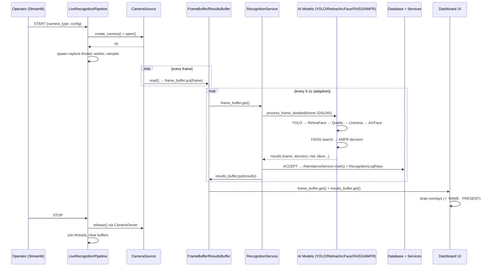

# Section 20 — Complete Workflow

## 20.1 End-to-End Narrative (simple language)

1. An operator opens the **Live Recognition** page and clicks **START**.
2. The page creates a camera source and starts a background capture thread.
3. A person walks in front of the camera.
4. YOLO finds the person; the tracker assigns them an ID.
5. RetinaFace finds their face; quality and liveness checks run.
6. ArcFace creates their face fingerprint; FAISS finds the closest match.
7. AMFR combines everything and decides: **ACCEPT**.
8. Attendance is marked in the database and CSV; the screen shows a green
   box with the name and "PRESENT".
9. The dashboard and attendance page show the record; analytics update.

## 20.2 Sequence Diagram (Mermaid)



## 20.3 Step-by-Step Detail

### Step 1 — Open camera
`LiveRecognitionPipeline.start()`:
- `create_camera(source_type, **kwargs)` (factory) → `open()` →
  `set_resolution(640,480)` → FPS cap 15.
- Failures produce `ERROR` status with a readable message.

### Step 2 — Capture
`_capture_loop` reads frames; `frame_buffer.put(frame)` keeps the latest.
Status → LIVE. On read failure → DISCONNECTED → reconnect (≤5 tries).

### Step 3 — Detect people (YOLO)
`FaceDetector.detect()` on the 320×240 downscale; filter person class;
early-exit if empty.

### Step 4 — Track
`AMFREngine.process_frame()` first calls `tracker.update(bbox-only)` to
assign `track_id`; per-track liveness detectors are (re)created/cleaned.

### Step 5 — Face & embedding per person
For each detection: `crop_person()` → `recognizer.detect_face()` (face +
landmarks + embedding) → `enrollment.search(embedding, k=1, threshold)`.

### Step 6 — Quality + Liveness
`_evaluate_person()` runs `FaceQualityAssessment.assess()` and
`LivenessDetector.analyze_frame()` (per track), then `_decide()` computes the
weighted risk and decision.

### Step 7 — Act on decision
- **ACCEPT** → `_maybe_mark_attendance()` (cooldown + DB dedupe) →
  `AttendanceService.mark()` (DB+CSV+audit) → `RecognitionLogRepo.create()`
  → results carry `attendance_marked`.
- **BORDERLINE** → log recognition, keep collecting.
- **REJECT_SPOOF** → log spoof + `AuditService.log("SPOOF_ATTEMPT")`.
- **LOW_CONFIDENCE** → save unknown face (3 s cooldown) + `UnknownFaceRepo`.

### Step 8 — Second tracker update
Enriched results are fed back into the tracker for identity stability,
then augmented with `track_id`, `track_frames`, `identity_stability`.

### Step 9 — Publish & display
Worker scales bboxes back to display size and publishes to
`results_buffer`. UI draws overlays + HUD (FPS, enrolled, tracks).

### Step 10 — Persistence & reports
Attendance rows appear in the Dashboard/Attendance/Analytics pages via
cached queries. API clients can query `/attendance`, `/analytics/*`,
and subscribe to `/events/stream`.

## 20.4 Attendance-Dedup Detail

```
ACCEPT for "Alice"
  → already in _marked_this_session?  → skip
  → cooldown (now - last) < 60s?      → skip
  → AttendanceRepo.is_marked_today()? → add to session cache, skip
  → else → mark (DB + CSV + audit) → session cache += Alice
```

## 20.5 Failure Modes & Recovery

| Failure | Behavior | Recovery |
|---------|----------|----------|
| Camera read error | status DISCONNECTED | auto-reconnect ≤5 tries |
| Inference exception | worker error counted; feed keeps showing last frame | continues next cycle |
| DB write error | logged warning; CSV may still record | transient |
| FAISS model load fail | fallback CNN for liveness | reload via Health page |
| Redis down | all Redis calls degrade (logged) | optional |

---

*References: `dashboard/pages/04_Live.py`, `services/recognition_service.py`,
`app/amfr_engine.py`, `app/live_detection.py`, `services/attendance_service.py`*
