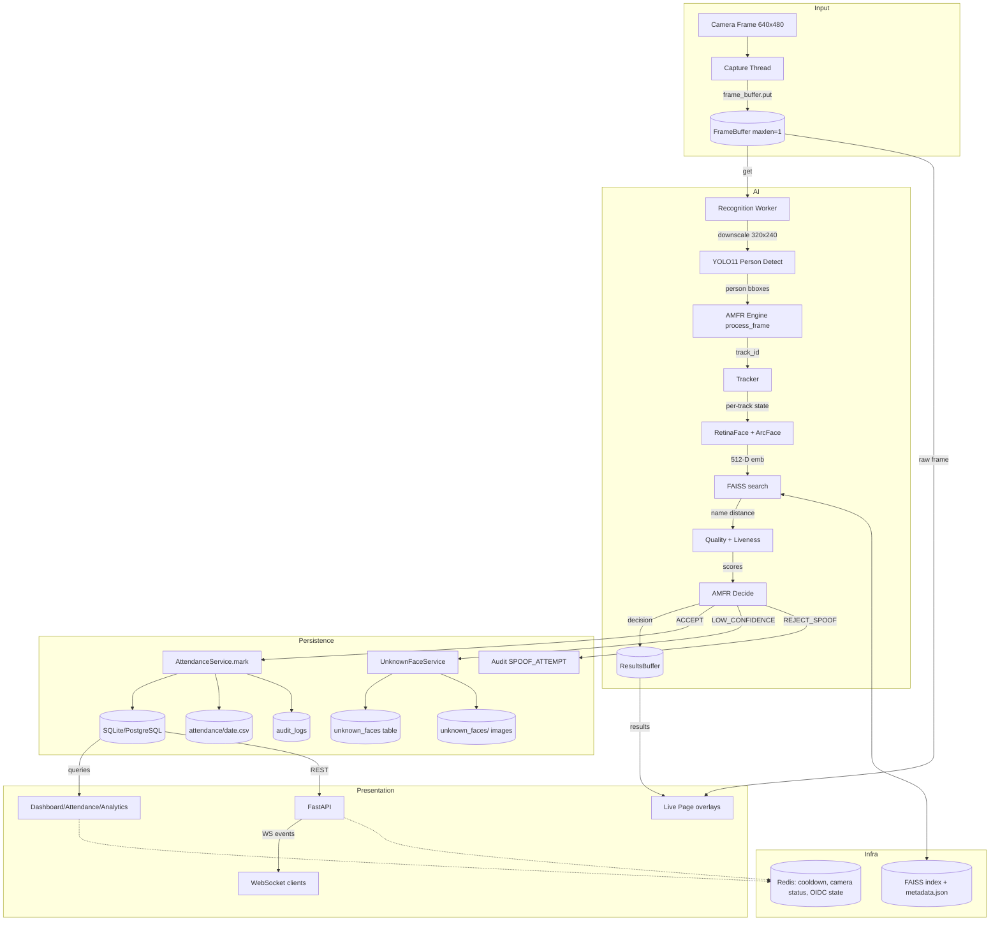

# Section 21 — Complete Data Flow

## 21.1 Data Flow Diagram (Mermaid)



## 21.2 Data Items & Their Lifecycle

| Data item | Created by | Stored in | Consumed by | Retained |
|-----------|-----------|-----------|-------------|----------|
| Camera frame | camera read | in-memory buffers only | pipeline, display | never (latest-only) |
| YOLO detections | face_detector | in-memory per frame | AMFR | per-frame |
| Track state | tracker | in-memory (`_tracks`) | AMFR smoothing | until track lost (>30 frames) |
| Face embedding | recognizer | FAISS index (enrolled), in-memory (query) | enrollment.search | enrolled: forever (file) |
| Recognition result | AMFR | recognition_log table | dashboard activity, analytics | forever |
| Attendance record | AttendanceService | attendance table + CSV | dashboard, analytics, API | forever |
| Unknown face | pipeline | unknown_faces table + image file | gallery, review | retention_days (30) |
| Audit entry | AuditService / log_audit | audit_logs table | security review | forever |
| User/token | auth endpoints | users + refresh_tokens | get_current_user | until revoke/expiry |
| OIDC state | oidc login | Redis (5 min TTL) | callback CSRF | 5 minutes |

## 21.3 Flow Paths by Feature

### Recognition → Attendance (primary)
```
frame → YOLO bbox → track_id → face + emb → FAISS → quality/liveness
     → AMFR decision → AttendanceService.mark → attendance row + CSV
     → audit + recognition_log → dashboard refresh
```

### Unknown person
```
LOW_CONFIDENCE → person crop saved (3s cooldown) → unknown_faces row
     → gallery → admin review → convert_to_employee
        → ArcFace emb → FAISS add → Employee row → converted=true
     or ignore (reviewed=true) / delete (row + file)
```

### Enrollment
```
photo → FaceRecognizer.extract_embedding → FaceEnrollment.enroll (FAISS)
     → EmployeeService.create (DB, faiss_id) → audit ENROLL
     (on DB failure → FAISS rollback remove_by_name)
```

### API client
```
login → JWT (+MFA if required) → authorized request → service/repo
     → audit + response → refresh rotation on expiry
```

### Backup
```
pg_dump (SQL) + faiss.index + metadata.json → backups/backup_ts/
     manifest.json (hashes) → restore verifies hashes → drop/create/psql
     → FAISS artifacts copied back → restart app
```

## 21.4 Streaming vs Batch Data

| Path | Type | Notes |
|------|------|-------|
| Camera → buffers → UI | streaming (frames) | latest-only, non-blocking |
| Recognition events → WebSocket | streaming (events) | buffered (100), role-filtered |
| Recognition → DB writes | event-driven writes | per ACCEPT/UNKNOWN/SPOOF |
| Attendance queries | on-demand reads | cached (TTL) in dashboard |
| Analytics charts | aggregated reads | SQL group-by |
| Bulk imports/exports | batch | CSV via BulkOperations |

## 21.5 Data Integrity Notes

- Attendance dedupe prevents duplicates (session + cooldown + DB check).
- Employee rename/delete synchronizes FAISS labels (rename) / embeddings (delete).
- Unknown-face conversion rolls back the Employee row if FAISS add fails.
- Backups include SHA-256 manifests verified on restore.
- Redis state is ephemeral by design (TTLs) — no integrity risk on loss.

---

*References: `app/*`, `services/*`, `api/*`, `database/*`, `scripts/backup.py`*
