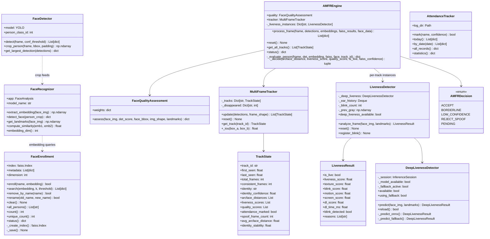
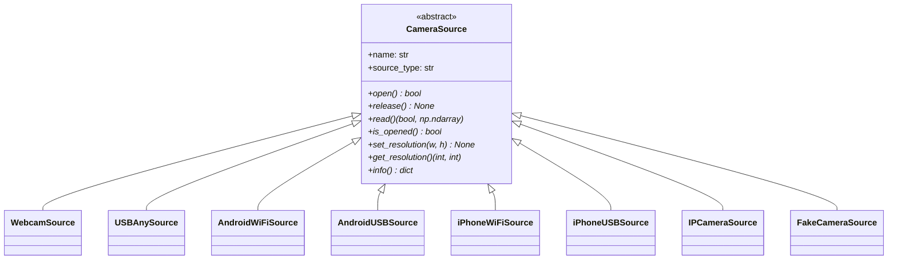
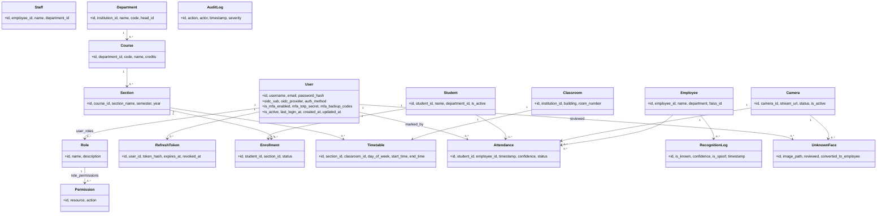

# Section 22 — Complete Class Diagram (UML)

UML class diagrams for the major subsystems, derived from source.

## 22.1 AI Pipeline Classes

## 22.2 Camera Classes

## 22.3 Service & Dashboard Classes

```mermaid
classDiagram
    class RecognitionService {
        +detector: FaceDetector
        +recognizer: FaceRecognizer
        +enrollment: FaceEnrollment
        +amfr: AMFREngine
        -_marked_this_session: set
        +process_frame(frame) np.ndarray
        +process_frame_detailed(frame) tuple
        +with_shared_models(models) RecognitionService
        +reset_tracking() None
        +status() dict
        -_maybe_mark_attendance(name, employee_id, confidence) bool
        -_log_recognition(...) None
        -_handle_unknown_face(face_img) None
    }

    class AttendanceService {
        +mark(employee_id, confidence, camera_id, operator, employee_name) bool
        +get_today() List
        +get_by_date(date) List
        +get_by_employee(id) List
        +get_statistics() dict
        +to_dict(record) dict
    }

    class EmployeeService {
        +create(...) Employee
        +get_by_name(name) Employee
        +update(employee_id, name, department) Employee
        +delete(employee_id) bool
        +remove_faiss_embedding(name, fallback) bool
        +count() int
    }

    class UnknownFaceService {
        +get_statistics() dict
        +get_filtered(...) List
        +convert_to_employee(face_id, employee_id, name, department) bool
        +delete_all() int
        +auto_cleanup(days) int
    }

    class AuditService {
        +log(action, description, operator, employee_id) None
        +get_recent(limit) list
        +get_by_action(action) list
    }

    class BruteForceProtection {
        +is_locked_out(username, ip) tuple
        +record_failed_attempt(...) None
        +record_successful_login(...) None
        +get_lockout_info(username) dict
        +cleanup_old_attempts() int
    }

    class MFAService {
        +generate_secret(email) tuple
        +verify_totp(secret, code) bool
        +generate_backup_codes() tuple
        +verify_backup_code(hashes, code) tuple
        +enroll_user(user) tuple
        +requires_mfa(user) bool
    }

    class OIDCService {
        +enabled: bool
        +get_login_url(request, state) str
        +handle_callback(code, state, expected) OIDCUserInfo
        +sync_user(user_info) User
    }

    class LiveRecognitionPipeline {
        +source_type: str
        -_cam: CameraSource
        -_service: RecognitionService
        -_threads: list
        -_verified_at: dict
        +start() bool
        +stop() None
        +fps: float
        +ai_fps: float
        +pipeline_latency: float
        +people_count: int
        +status: str
        +latency_stats() dict
        -_capture_loop() None
        -_recognition_worker() None
        -_latency_loop() None
    }

    class SharedModelResources {
        +service: RecognitionService
        +load() SharedModelResources
    }

    class CameraOwner {
        -_instance: CameraOwner
        +get() CameraOwner
        +can_acquire() bool
        +acquire(camera, pipeline) bool
        +release() None
        +is_owned() bool
        +get_status() dict
    }

    class FrameBuffer {
        +put(frame) int
        +get() np.ndarray
        +get_with_meta() tuple
        +close() None
        +has_frame() bool
    }

    class LatencyLogger {
        +record(ms) None
        +stats() dict
        +p50() float
        +p95() float
    }

    LiveRecognitionPipeline --> RecognitionService
    LiveRecognitionPipeline --> CameraSource
    LiveRecognitionPipeline --> LatencyLogger
    LiveRecognitionPipeline --> SharedModelResources
    LiveRecognitionPipeline --> FrameBuffer
    CameraOwner --> LiveRecognitionPipeline : owns
```

## 22.4 ORM Models (summary — full schema in §8)

---

*References: class definitions in `app/*`, `camera/*`, `services/*`,
`dashboard/*`, `database/models.py`*
